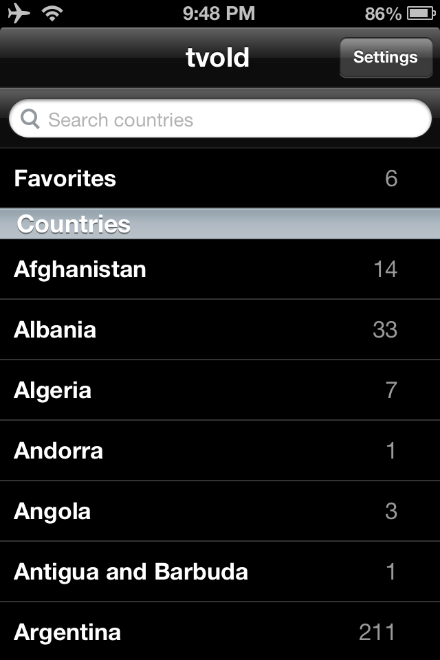
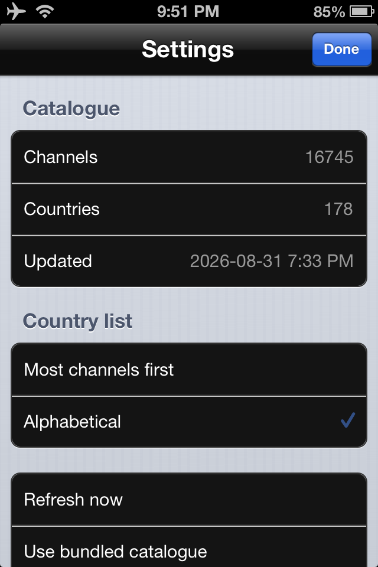

# tvold

An IPTV player for **iOS 6**, built for a jailbroken iPhone 4S / iPhone 5.

It browses the public [iptv-org](https://github.com/iptv-org/iptv) catalogue
(16,763 channels across 178 countries) and plays them on hardware that predates
every modern way of doing it. Written in Swift, compiled with a 5.6.3 toolchain
and shipped against the 5.1.5 runtime so it will actually load on an A5.

## Why this is not trivial

iOS 6 cannot reach the modern web. Its TLS stack is too old for the ciphers
almost every stream origin now requires, and essentially the whole catalogue is
HTTPS. The app works around this with a **loopback HTTP proxy**
(`LocalStreamProxy`). The system media player is pointed at `127.0.0.1`, and the
proxy fetches upstream through a vendored libcurl + OpenSSL, rewriting playlists
so every nested URL comes back through itself. That also lets it inject the
`User-Agent` and `Referer` headers some origins demand, which the player cannot
set on its own.

A second problem: some streams carry **AC-3 audio**, which the iOS 6 media stack
cannot decode. Those are transcoded to AAC on the fly (demux the MPEG-TS, decode
AC-3 with a vendored FFmpeg, re-encode as AAC, remux) before the player ever
sees them.

## Screens

| Screen | What it does |
|---|---|
| **Countries** | The catalogue, ordered by channel count or alphabetically. Favourites live at the top. |
| **Channels** | A grid of logo tiles for one country, with search. |
| **Player** | Fullscreen. Swipe left/right to zap, down to close, tap for controls. |
| **Settings** | Catalogue refresh, country sort order, diagnostics, the debug log. |

| Countries | Settings |
|---|---|
|  |  |

Both shots are an iPhone 4S on iOS 6. The channel count in Settings is lower
than the figure above because that device is running a refreshed catalogue
rather than the bundled one.

## The "Check" button

Roughly **half of any public IPTV catalogue is dead at any given moment**, and
which half changes constantly. Opening a channel only to stare at a spinner for
15 seconds is the single most annoying thing about using one of these lists.

**Check** (top right of a country's channel grid) tests every stream in that
country and dims the ones that do not answer.

How it works:

* Only `.m3u8` playlist URLs are checked. A raw MPEG-TS endpoint never ends, so
  a request against one would run for the full timeout and prove nothing. Those
  stay unchecked, and unchecked always counts as alive.
* Six requests run in parallel. Deliberately more than the two cores an A5 has,
  because these threads spend their time waiting on a socket rather than
  computing. The standard "one job per core" approach would take four times as
  long.
* A stream counts as **alive only if the response body is actually a playlist**
  (contains `#EXTM3U`). An HTTP 200 on its own is not enough. Parked domains,
  captive portals and ISP block pages all answer 200 with HTML, and those are
  exactly the origins that would otherwise be marked alive forever.
* Verdicts are written as they land, so stopping the scan halfway still leaves
  the list better informed than it was. Press **Stop** (the same button) or
  simply leave the screen to cancel. It also stops automatically when you open a
  channel, so the scan is not competing with playback for bandwidth.
* Progress replaces the country name in the title bar while it runs.

What a verdict means:

* Dead channels are **dimmed, not hidden**, and sink to the bottom of the list.
  A verdict can be up to a week stale, and a stream that came back should still
  be one tap away.
* Verdicts **expire after 7 days**. An unknown stream is always treated as
  alive.
* Only failures are stored, so the store stays small: a few hundred URLs at
  worst. Entries are keyed by stream URL rather than by channel name or
  position, both of which move when the catalogue is refreshed.
* **You do not have to run Check at all.** Every time you play a channel the
  result is recorded. Reaching a playable state marks it alive, and the
  15 second connect watchdog marks it dead. Check only fills in the channels
  nobody has opened yet.

Because a wrong verdict costs a dimmed tile and never a hidden channel, the scan
is deliberately biased toward marking things alive.

## Updating the catalogue

The catalogue is a set of compact per-country JSON files in `index/`, plus a
`countries.json` manifest. There are two ways to refresh it.

### On the device: Settings, then Refresh

Downloads the four raw iptv-org API files (~20.7 MB, straight to disk, never
through memory), rebuilds the index on-device, and swaps it in. The new index is
only swapped in once it is complete on disk, so a refresh that is interrupted
leaves the previous catalogue intact.

Settings also offers **Revert to bundled**, which drops the refreshed index and
goes back to the one that shipped with the app. That is the way out of a refresh
which produced a worse catalogue than the one it replaced.

One caveat worth knowing: the on-device rebuild **cannot run the liveness
probe** that the desktop script does. That probe is around 17,000 HTTP requests,
which is not something to ask of a phone. So a refreshed catalogue carries
noticeably more dead entries than the bundled one. The Check button and the
player's connect watchdog are what cover the difference.

### On a Mac: `tools/build_index.py`

The bundled index is generated here, and this is the version that can afford to
be picky:

```bash
# fast: format filtering only
./tools/build_index.py --out index

# slow, and what the shipped index is built with.
# additionally drops streams that are dead or serve fMP4
./tools/build_index.py --out index --probe --workers 40
```

It reads the [iptv-org static API](https://iptv-org.github.io/api) and filters:

* **Dropped by format:** DASH (`.mpd`) and `rtmp`, `rtsp`, `srt`, `mmsh`. The
  iOS 6 media stack has no support for these regardless of transport.
* **Dropped by `--probe`:** anything that does not answer with `#EXTM3U`, and
  anything serving fMP4 (`#EXT-X-MAP`, `.m4s`), which iOS 6 cannot decode.
* **Logos** are kept only in formats `UIImage` can decode (png, jpg, gif). The
  catalogue also carries `.svg` and `.webp`, which would just be a wasted fetch
  per cell.

Output is one file per country plus the manifest. Per-country rather than one
big file because the full catalogue is ~2 MB of JSON, and parsing that in one go on an iPhone 4S is slow and spikes memory. Splitting it keeps the parse cost proportional to what you are actually looking at.

Copy the resulting `index/` into the app bundle to change what ships.

## Source and attribution

Channel data comes from **[iptv-org](https://github.com/iptv-org/iptv)**, via
its static API at <https://iptv-org.github.io/api>.

Used as **data only**. None of that project's code or tooling is downloaded,
executed, or vendored. `build_index.py` reads the published JSON and nothing
else. iptv-org aggregates publicly available streams; it does not host any of
them, and neither does this app.

Icons are drawn from [Phosphor](https://phosphoricons.com) (MIT) geometry,
transcribed as paths. No asset ships and no repository is cloned.

## Building

See [`CLAUDE.md`](../CLAUDE.md) for the full toolchain story. In short: sources
are mirrored in `src/`, copied to the build server, and built with `./build.sh`,
which produces `tvold_ios6.ipa`. The app is compiled with Swift 5.6.3 but ships
the 5.1.5 runtime dylibs, patched down to `MinimumOSVersion 6.0` and ad-hoc
signed.

## Installing

Currently a sideloaded IPA, via Filza or similar on a jailbroken device.

A Cydia repository at **cydia.rousseaddict.online** is planned, which will make this installable the normal way. That is not up yet.

## Status

Working on device: catalogue browsing, favourites, logos, playback through the proxy, the AC-3 to AAC transcode, dead-stream marking, and catalogue refresh.

Tested on iPhone 4S (iOS 6) and iPhone 5 (iOS 7).

Known limitation: streams that ship **audio and video as separate HLS
renditions**, play silently or not at all. Joining them in the proxy has been scoped but not built.
